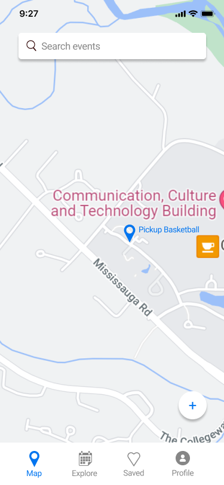
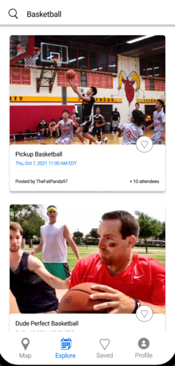
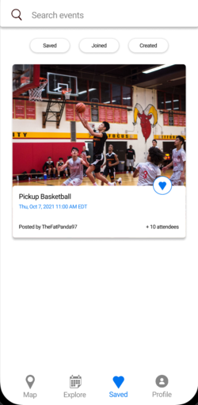
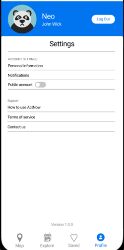

# How to Use

### Sign up/ Sign in

To use the app, you can either sign in with your Google account or create an account using an email and password.

### Available Pages

#### Maps Page

On this page, you would be able to see recent events available in your area. Events can be either of 2 types: user-created or scraped events. For all events, you would be able join the event and see the details of the event. If you are the creator of the event, you can also edit the details or delete the event. For scraped events, you can also click on the link of the event to go to the eventbrite page of the event.

#### Explore Page

On this page, you would be able to see a list of event in your location in card form. Similar to the maps page, you would be able join/edit the events if you click on the event card. One extra features if that you can double click on the event card to save the event for later.

#### Saved Page

On this page, you would be able to filter through events that you have saved, joined, or created. The purpose is for you to be able to better manage events you are interested in.

#### profile Page

On this page, you would be able to access some common settings, such as your username, profile picture, and whether you would want to share your location with other users by toggling the public account feature. You will also be able to see some guides on how to use the app.

