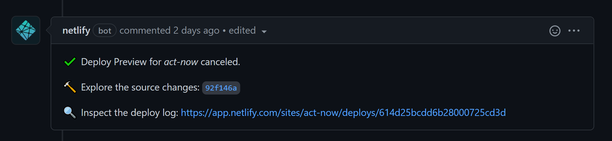

# How to contribute

## Contribution
To make a contribution to our application, visit our [GitHub]("https://github.com/GDSCUTM-CommunityProjects/ActNow") and make an issue. Currently, we have 3 issue templates:

1. Feature request
2. Documentation request
3. Bug report

When you are working on anything new, please select one of the templates above and fill in the details required. In very cases where you work does not belong in any of these categories, then make an separate issue and fill out as much detail as possible. 

## Branch naming
Although we do not have specifics requirements for what your branch needs to be named, the convention we follow is as follows: 

1. Features -> feat/...
2. Bugs -> bug/...
3. Documentation -> docs/...

## Running the website locally
To run the website locally, follow the steps below:

1. git clone the project
2. navigate to `src/documentation`
3. run the command `npm ci` to install the necessary libraries
4. run the command `npm start` to start developing locally

## Writing docs
For our application, all docs are written in markdown. To write docs, follow the steps below:

1. Make a docs issue detailing what part of the project are you writing or changing the docs
2. Make a branch named docs/<reasonable name\> and begin writing docs
3. When writing docs, all documentation will go under `src/documentation/docs` and documentation could either be written in `md` or `mdx` files. Visit https://www.markdownguide.org/getting-started/ to learn about how to write markdown. Images will go under `src/documentation/static/img`. There are no enforced styling when writing docs but the rule of thumb to have clear titles, easy to understand instructions, and pictures if necessary.
4. When you are done, make a pull request and request some of the ActNow team to review the PR.
    - In the pr, there should a github action checking to see a preview of the docs deployed on staging, make sure that this check passes, otherwise that means the docs will not be deployed properly.
    - Example: 