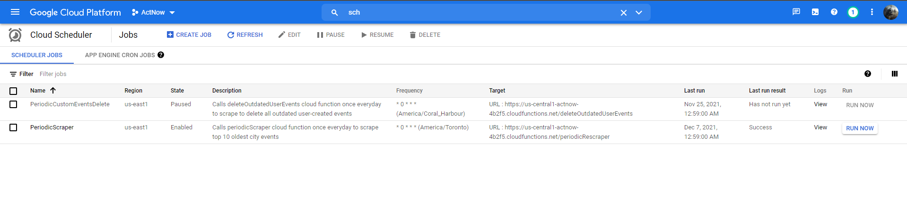

# Cloud Scheduler

## What is a cloud scheduler?
This is one of the features under google cloud, just cloud functions. It's basically a fully-managed enterprise-grade cron job scheduler. This basically allows any applcation to setup a routine to repeat itself after every given interval of time. [Reference](https://cloud.google.com/scheduler)

## How ActNow leverages it?
Our application needs to have the latest events be available for every user for their location whenever and whenever they are. There are a few things that we need to make sure to give the user the best experience of the app.

After sometime, or after the event is over the firestore database needs to be updated to remove all the outdated events, so that they are not shown to the user only for them to realize that the event no longer exists.

So, to provide this functionality we can leverage the cloud scheduler to delete all the outdated events by periodically calling the scraper routines every night around midnight. 

Therefore, the cloud scheduler every midnight calls the [periodicScraper](./breakdown.md#periodicscraper) to delete all the outdated scraped events and scrape the same cities again to get the latest events. And calls the [deleteOutdatedUserEvents](./breakdown.md#deleteoutdateduserevents) to delete the outdated user events.

